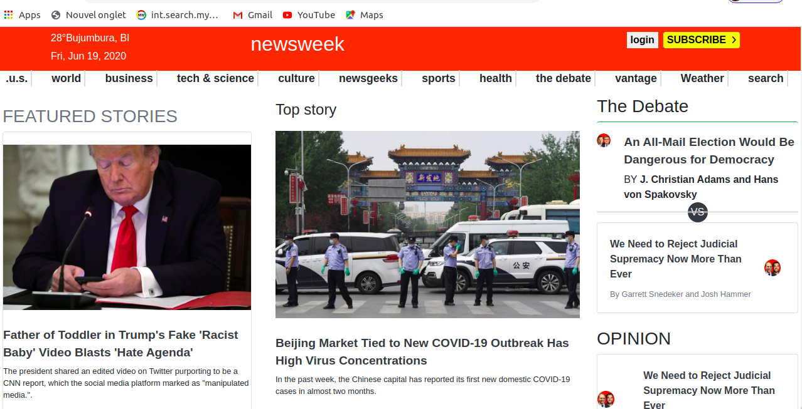
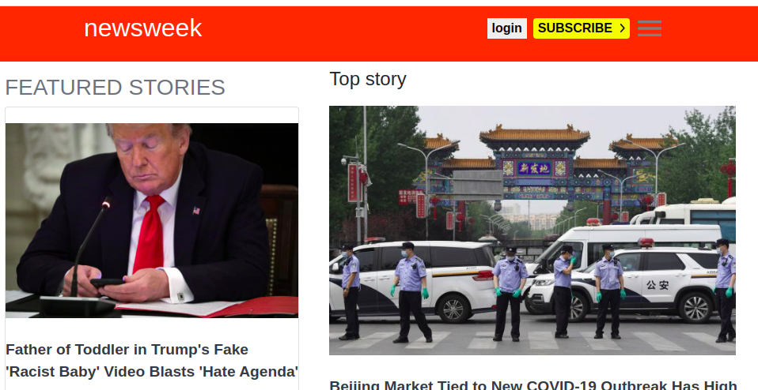

# newsweek
In this project, I’ll get a chance to try out Twitter’s Bootstrap framework by building a site that actually uses it :  Newsweek.

<!-- PROJECT LOGO -->
<<<<<<< HEAD
## This is a clone application of Newsweek.
 
 
 
=======
## This is a clone application of News week.
-  
-  
-  
>>>>>>> 69df58657c1bef21d3ded63c00b36b42b667e919
 

   <h3 align="center">News Week Page</h3>

  

    A simple clone of the The News Week Page.
         
     
    ·
     <a href="https://raw.githack.com/Guy-Gustave/newsweek/feature-branch/index.html ">Live Demo</a>
    ·    
  

<!-- TABLE OF CONTENTS -->
## Table of Contents

* [About the Project](#about-the-project)
* [getting started](#getting_started)
* [Built With](#built-with)
* [Contact](#contact)
* [Acknowledgements](#acknowledgements)

<!-- ABOUT THE PROJECT -->
## About The Project

  I am Gustave. I am part of the Microverse Project and I did this page according to the required specifications.  

## Getting started
**For this project, we tried our best to recreate the newsweek page. The main aim is to ensure the elements get placed and styled roughly the same way using responsive using booststrap as newsweek page.**

We built our own page in a .html text file and opened it in our browser to check it out. We carried out the following steps:
  - First setup a github repository for the project.
  - Then create a .html file where all our HTML markup will go
  - Create a .css file where some elements of our styling code will reside
  - Then open the Newsweek page on https://www.newsweek.com/  .

### Build With

* [Html]()
* [CSS]()
* [BOOTSTRAP]()

### Contact
* Gustave 
- [@NigabaG](https://twitter.com/GSakubu)  
- [LinkedIn](https://www.linkedin.com/in/guy-gustave-nigaba-7988ba181/) 
- [GitHub](https://github.com/WCanirinka)

## Contributing
Contributions, issues and feature requests are welcome!

   1. Fork the Project
   2. Create your Feature Branch (git checkout -b feature/AmazingFeature)
   3. Commit your Changes (git commit -m 'Add some AmazingFeature')
   4. Push to the Branch (git push origin feature/AmazingFeature)
   5. Open a Pull Request

### Acknowledgements

* [GitHub](https://github.com)
* [Microverse](https://www.microverse.org/)
* [The Odin Project](https://www.theodinproject.com/courses/html5-and-css3/lessons/embedding-images-and-video#introduction)
* [StyleLint]()
* [Stickler]()

